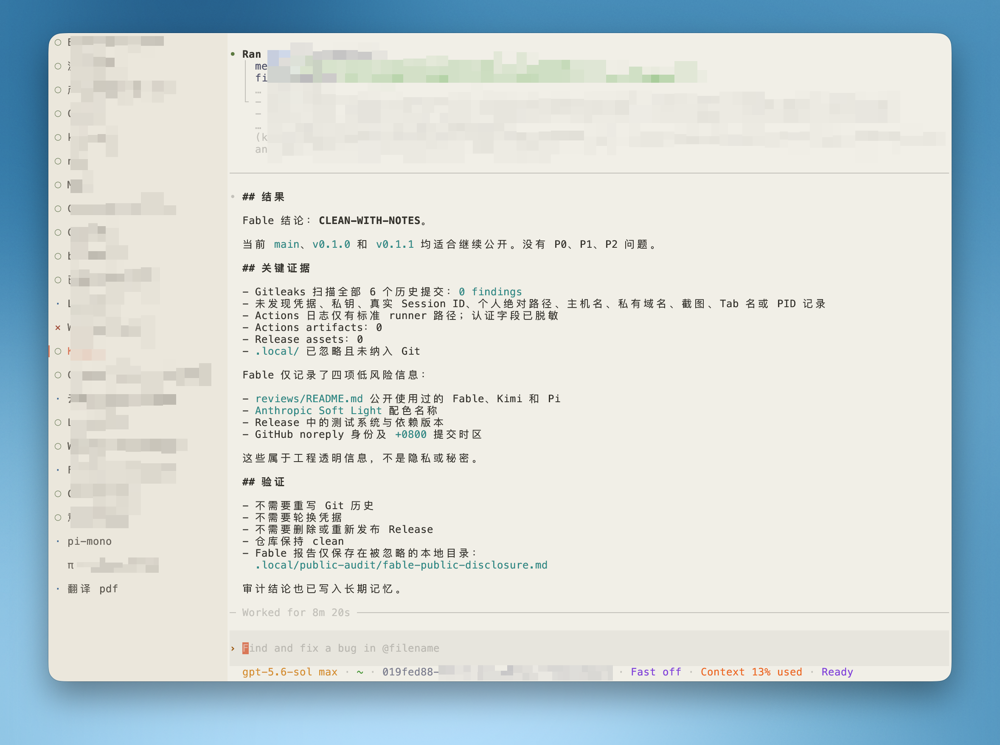

# Kitty Agent Sidebar

Kitty Agent Sidebar shows Codex CLI and Claude Code state beside the user's manual tab
name. It also records private five-minute Session-ID/tab-name snapshots for recovery.

The live UI is event-driven. It has no polling daemon. It does not parse or replace window
or tab titles. It does not patch Codex or Claude Code.

An unread agent event stays visible in a background tab. Selecting that tab clears the
agent dot only when the pane is in the selected tab of the focused, visible Kitty OS window.
The active rail and the unread dot are separate cells and separate states.



## Display

Each row uses the same three-cell prefix:

```text
<attention><state><space><manual tab title>
```

| Mark | Meaning |
|---|---|
| `·` | working |
| `○` | ready |
| `!` | needs action |
| `×` | error |
| `–` | disconnected |
| `?` | evidence is incomplete |
| `•` in the attention cell | unread state change or terminal bell |
| `▎` in the attention cell | selected tab |

There is no checkmark and no emoji bell. The active row does not shift horizontally.
Inactive agent titles use four contrast-safe age levels: under 15 minutes, under one hour,
under six hours, and older. The included palette preserves the existing Anthropic Soft
Light sidebar. Other themes can replace the color constants in `kitty/tab_bar.py`.

## Requirements

- Kitty 0.48 or later for vertical tabs.
- Python 3.9 or later.
- macOS for the packaged five-minute collector.
- Codex CLI or Claude Code versions with command Hooks.

See [compatibility](docs/compatibility.md) for component-specific version floors.

## Install

Review the files before install. Then run:

```sh
cd ~/.codex-work/kitty-agent-sidebar
./scripts/manage.py install
```

Do not use `pip install`. `pyproject.toml` provides project metadata and build-tool support,
but a Python wheel cannot merge the official Agent Hooks, install the Kitty files, or load the
LaunchAgent. `scripts/manage.py` is the supported installer.

Add this line to `kitty.conf`:

```conf
include sidebar.conf
```

The installer copies `sidebar.conf`, `tab_bar.py`, and the watcher. It does not edit
`kitty.conf`, the user's theme, or key maps. Reload Kitty config after adding the include.
It creates the filesystem-socket parent with mode `0700` before Kitty binds the socket.

The installer merges only its marked Hook commands into `~/.codex/hooks.json` and
`~/.claude/settings.json`. It preserves unrelated settings and Hooks. Existing conflicting
managed files are backed up. Later user edits are never overwritten unless `install
--force` is used. It installs a 300-second low-priority LaunchAgent.

Check the installation:

```sh
./scripts/manage.py doctor
~/.local/bin/kitty-agent-snapshot --print
```

## Remote control scope

The Hook bridge uses the current pane's OSC `SetUserVar`. It does not need Kitty remote
control. The collector needs a filesystem Unix socket so it can list all panes in every
Kitty instance. Recommended config:

```conf
allow_remote_control socket-only
listen_on unix:${HOME}/.local/state/kitty-agent-status/kitty-rc
```

The collector finds the actual socket from each live Kitty GUI process. It does not depend
on a fixed PID or on one Kitty instance.

## Optional draggable width

Stock Kitty supports the vertical sidebar. The patch in `patches/` adds an opt-in resize
handle inside the sidebar. It does not make the terminal edge draggable.

Apply it to a matching Kitty 0.48 source tree, build Kitty, and then enable:

```conf
vertical_tab_bar_resize yes
```

The patch is optional and GPL-3.0-only. See [patch applicability](patches/README.md) and
[architecture](docs/architecture.md).

`patches/kitty-macos-menubar-chevron.patch` is a separate optional macOS preference. It
uses `>` instead of Kitty's `::` before the dynamic menu-bar title. It is not part of the
portable sidebar or resize feature.

## Uninstall

```sh
./scripts/manage.py uninstall
```

The command removes only files and Hook groups owned by this project. It retains private
snapshots. Remove those separately if required.

## Security and privacy

- Hook input is bounded to 2 MiB.
- State files and logs use private permissions.
- Socket candidates must be owned Unix sockets and must pass peer-PID verification.
- Ambiguous Session identity is `null`; the collector does not guess.
- Snapshots include Session ID and bounded manual tab name. They exclude cwd, environment,
  prompt, screen text, and tool content.

Read [privacy](docs/privacy.md) before publishing or sharing a snapshot.

## Development

```sh
/usr/bin/python3 -m unittest discover -s tests -v
python3 -m compileall -q src kitty scripts tests
```

The macOS CI matrix tests Python 3.9 and a current Python release. A separate job verifies
that both optional patches apply to the pinned Kitty commit.

For security reports, see [SECURITY.md](SECURITY.md). Do not attach private snapshots or
Session IDs to a public issue.

The authoritative local Kitty patch was generated from commit
`e95da80fdbbf317917a106c8e1bcf8032c875c80` plus the listed changes. Rebase and rerun Kitty's
option tests before using it with a different source revision.

## License

GPL-3.0-only. See `LICENSE` and `NOTICE`.

Release changes are recorded in [CHANGELOG.md](CHANGELOG.md).
